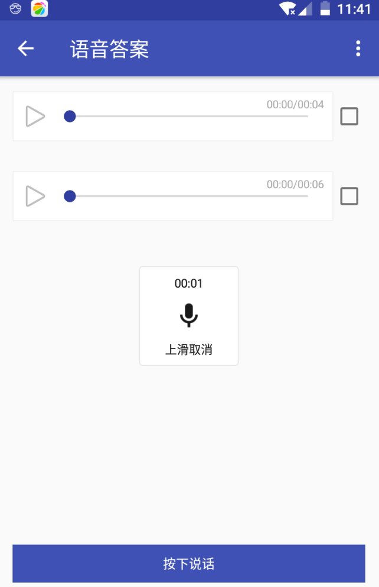
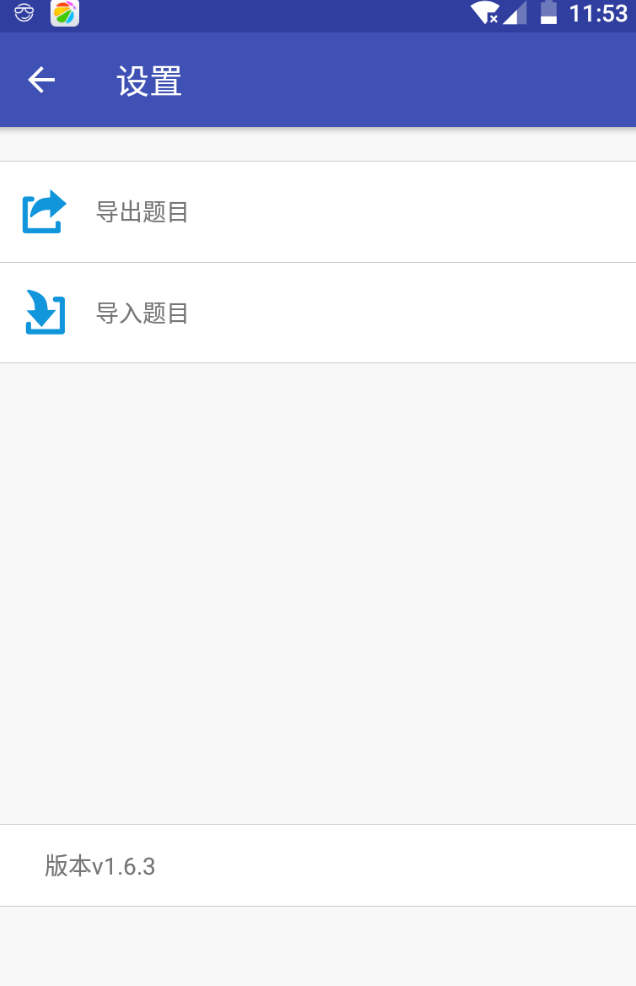

# 简介
DeveloperInterview 是一个用于开发者针对面试题录制语音回答复习的 App

# 技术点
## 依赖库
 - 基础核心类库：guava
 - 时间工具类：joda-time
 - 日志打印：orhanobut:Logger
 - json 序列化：Gson
 - 布局：constraint-layout:1.0.2
 - 加载框:AVLoadingIndicatorView
 - 录音：MediaUtils
 - 组件通信：eventbus
 - 网络框架：retrofit2
 - 异步框架：rxjava2
 - 升级安装：checkVersionLib
 - 升级安装源：fir.im
 - 热修复：Sophix
 - 插件化：Replugin

## 算法
 - 两个有序链表合并

## 设计模式
 - 单例模式
 - 状态模式
 - 构建者模式

## 其他
 - flavor 构建
 - webview内容搜索

# 介绍图

    

    

 

    

    

 

    

    

 

 

## 下载
[interview.apk](https://fir.im/interview)

# 拓展规划

下一个版本准备做的事情：

* 夜间模式
* 自由切换题目下载源地址
* 录制语音波形图
* 添加题目自动化 

# 致谢

- 感谢[工匠若水](https://github.com/TotemsCN/Base/blob/master/Java%20SE/Java.md) github 版每日一题。
