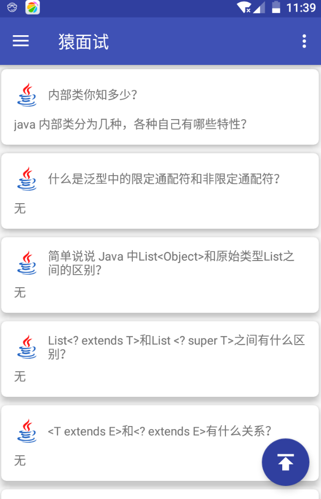
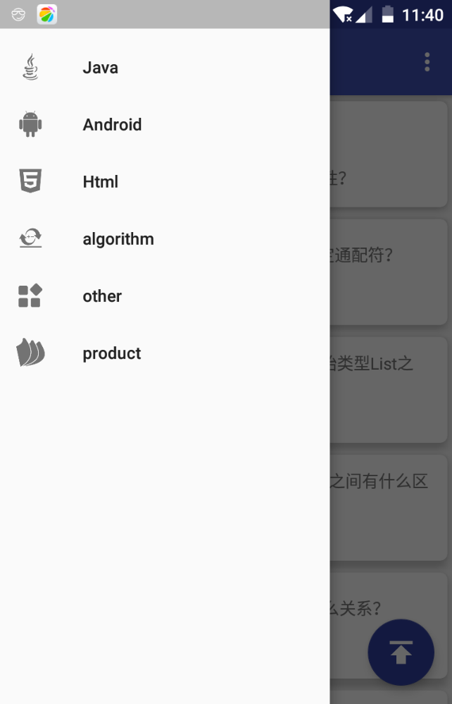
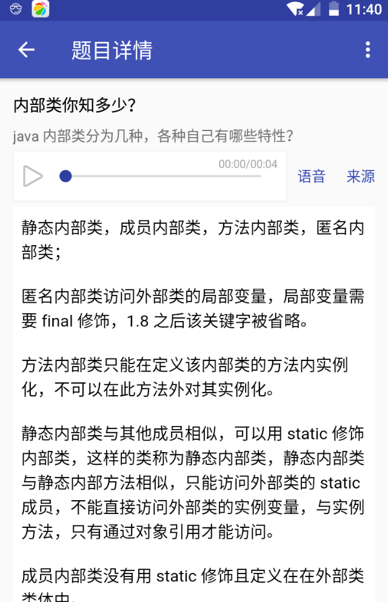
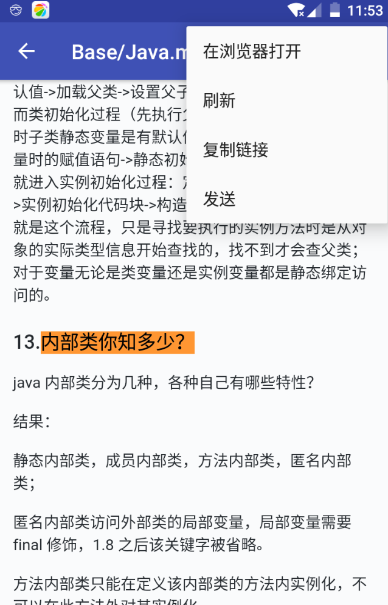

# 简介
DeveloperInterview 精简功能单纯查看题目内容App

## 下载
[interview.apk](https://fir.im/interview)

# 介绍图

    

    

 

    

    

# 致谢

- 感谢[工匠若水](https://github.com/TotemsCN/Base/blob/master/Java%20SE/Java.md) github 版每日一题。
